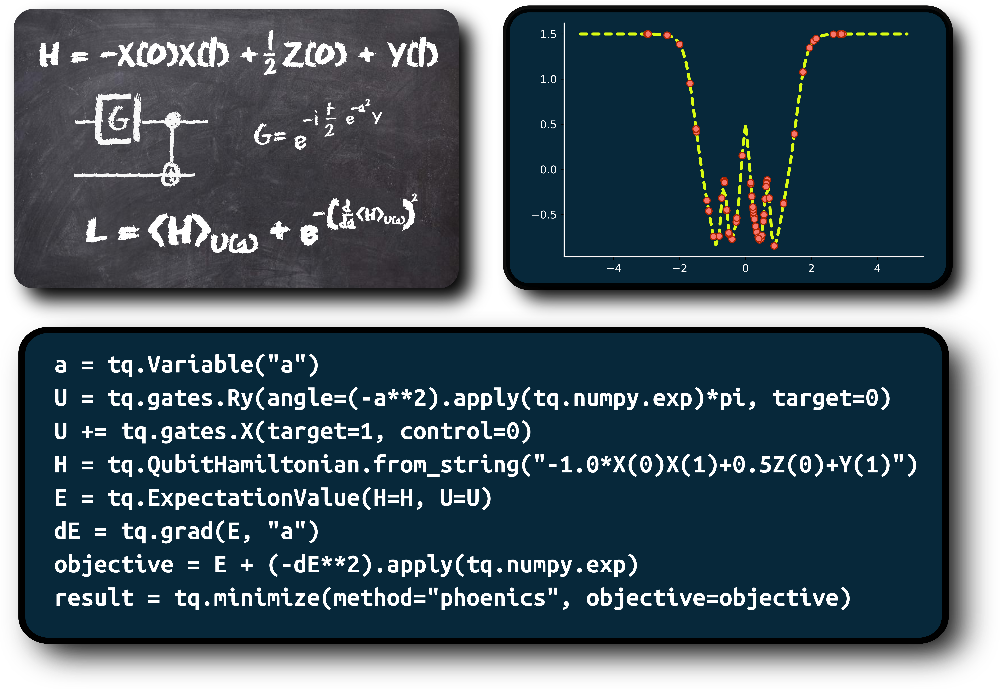

# Tequila

Tequila is an Extensible Quantum Information and Learning Architecture where the main goal is to simplify and accelerate implementation of new ideas for quantum algorithms. 
It operates on abstract data structures allowing the formulation, combination, automatic differentiation and optimization of generalized objectives.
Tequila can execute the underlying quantum expectation values on state of the art simulators as well as on real quantum devices.

[You can get an overview from this presentation](/docs/tequila.pdf) or from it's [video recording](https://www.youtube.com/watch?v=hUdf0P2fW2E)  

[Get started with our Tutorials](https://github.com/aspuru-guzik-group/tequila-tutorials)  

or checkout our [overview article](https://arxiv.org/abs/2011.03057)  

# Quantum Backends
Currently supported
- [Qulacs](https://github.com/qulacs/qulacs)
- [Qibo](https://github.com/Quantum-TII/qibo)
- [Qiskit](https://github.com/qiskit/qiskit)
- [Cirq](https://github.com/quantumlib/cirq)
- [PyQuil](https://github.com/rigetti/pyquil)

Tequila detects backends automatically if they are installed on your systems.  
All of them are available over standard pip installation like for example `pip install qulacs`.  
For best performance it is recommended to have `qulacs` installed.

# QuantumChemistry:
Currently supported
- [Psi4](https://github.com/psi4/psi4).  
In a conda environment this can be installed with  
```bash
conda install psi4 -c psi4
```
Here is a small [tutorial](https://github.com/aspuru-guzik-group/tequila-tutorials/blob/main/Chemistry.ipynb) that illustrates the usage. 

- [Madness](https://github.com/kottmanj/madness)  
Currently you need to compile from a separate [fork](https://github.com/kottmanj/madness).  
See the github page of this fork for installation instruction.   
Here is a small [tutorial](https://github.com/aspuru-guzik-group/tequila-tutorials/blob/main/ChemistryMadnessInterface.ipynb) that illustrates the usage.  


# Installation
We recommend installing in editable mode with  
```bash
git clone https://github.com/aspuru-guzik-group/tequila.git
cd tequila
pip install -e . 
```

**Do not** install over PyPi (Minecraft lovers excluded)  
<strike>`pip install tequila`</strike>

You can install `tequila` directly with pip over:  
```bash
pip install git+https://github.com/aspuru-guzik-group/tequila.git
```

Recommended Python version is *3.7*.    
Python 3.8 works, but not all (optional) dependencies support it yet.  
Python 3.6 works, but some (optional) dependencies might have issues with numpy >= 1.20.  


# Getting Started
Check out the tutorial notebooks provided in tutorials.

## Tequila Hello World
```python
# optimize a one qubit example

# define a variable
a = tq.Variable("a")
# define a simple circuit
U = tq.gates.Ry(angle=a*pi, target=0)
# define an Hamiltonian
H = tq.paulis.X(0)
# define an expectation value
E = tq.ExpectationValue(H=H, U=U)
# optimize the expectation value
result = tq.minimize(method="bfgs", objective=E**2)
# check out the optimized wavefunction
wfn = tq.simulate(U, variables=result.angles)
print("optimized wavefunction = ", wfn)
# plot information about the optimization
result.history.plot("energies")
result.history.plot("angles")
result.history.plot("gradients")
```

## Chemistry Hello World
```python
# define a molecule within an active space
active = {"a1": [1], "b1":[0]}
molecule = tq.quantumchemistry.Molecule(geometry="lih.xyz", basis_set='6-31g', active_orbitals=active, transformation="bravyi-kitaev")

# get the qubit hamiltonian
H = molecule.make_hamiltonian()

# create an k-UpCCGSD circuit of order k
U = molecule.make_upccgsd_ansatz(order=1, include_singles=True)

# define the expectationvalue
E = tq.ExpectationValue(H=H, U=U)

# compute reference energies
fci = molecule.compute_energy("fci")
cisd = molecule.compute_energy("detci", options={"detci__ex_level": 2})

# optimize
result = tq.minimize(objective=E, method="BFGS", initial_values=0.0)

print("VQE : {:+2.8}f".format(result.energy))
print("CISD: {:+2.8}f".format(cisd))
print("FCI : {:+2.8}f".format(fci))
```

Do you want to create your own methods? Check out the [tutorials](https://github.com/aspuru-guzik-group/tequila/tree/master/tutorials)! 

# Research projects using Tequila
J.S. Kottmann, A. Anand, A. Aspuru-Guzik.  
A Feasible Approach for Automatically Differentiable Unitary Coupled-Cluster on Quantum Computers.  
Chemical Science, 2021, [doi.org/10.1039/D0SC06627C](https://doi.org/10.1039/D0SC06627C).  
[arxiv.org/abs/2011.05938](https://arxiv.org/abs/2011.05938)  
General techniques are implemented in the chemistry modules of tequila.  
See the [tutorials](https://github.com/aspuru-guzik-group/tequila/tree/master/tutorials) for examples.  

J.S. Kottmann, P. Schleich, T. Tamayo-Mendoza, A. Aspuru-Guzik.  
Reducing Qubit Requirements while Maintaining Numerical Precision for the Variational Quantum Eigensolver: A Basis-Set-Free Approach.   
J.Phys.Chem.Lett., 2021, [doi.org/10.1021/acs.jpclett.0c03410](https://doi.org/10.1021/acs.jpclett.0c03410).  
[arxiv.org/abs/2008.02819](https://arxiv.org/abs/2008.02819)
[example code](https://github.com/aspuru-guzik-group/tequila/blob/master/tutorials/ChemistryBasisSetFreeVQE.ipynb)
[tutorial on the madness interface](https://github.com/aspuru-guzik-group/tequila/blob/master/tutorials/ChemistryMadnessInterface.ipynb)

A. Cervera-Lierta, J.S. Kottmann, A. Aspuru-Guzik.  
The Meta-Variational Quantum Eigensolver.  
[arxiv.org/abs/2009.13545](https://arxiv.org/abs/2009.13545) 
[example code](https://github.com/aspuru-guzik-group/Meta-VQE)

J.S. Kottmann, M. Krenn, T.H. Kyaw, S. Alperin-Lea, A. Aspuru-Guzik.  
Quantum Computer-Aided design of Quantum Optics Hardware.  
[arxiv.org/abs/2006.03075](https://arxiv.org/abs/2006.03075)
[example code](https://github.com/kottmanj/Photonic)  

A. Anand, M. Degroote, A. Aspuru-Guzik.  
Natural Evolutionary Strategies for Variational Quantum Computation.  
[arxiv.org/abs/2012.00101](https://arxiv.org/abs/2012.00101)  

Let us know, if you want your research project to be included in this list!

# Dependencies
Support for additional optimizers or quantum backends can be activated by intalling them in your environment.  
Tequila will then detect them automatically.  
Currently those are: [Phoenics](https://github.com/aspuru-guzik-group/phoenics)
 and [GPyOpt](https://sheffieldml.github.io/GPyOpt/).  
Quantum backends are treated in the same way.

# Documentation
You can build the documentation by navigating to `docs` and entering `make html`.  
Open the documentation with a browser over like `firefox docs/build/html/index.html`  
Note that you will need some additional python packages like `sphinx` and `mr2` that are not explicitly listed in the requirements.txt  

You can also visit our prebuild online [documentation](https://aspuru-guzik-group.github.io/tequila/)  
that will correspond to the github master branch

# How to contribute
If you find any bugs or inconveniences in `tequila` please don't be shy and let us know.  
You can do so either by raising an issue here on github or contact us directly.  

If you already found a solution you can contribute to `tequila` over a pull-request.  
Here is how that works:

1. Make a fork of `tequila` to your own github account.
2. Checkout the `devel` branch and make sure it is up to date with the main [github repository](https://github.com/aspuru-guzik-group/tequila).
3. Create and checkout a new branch from `devel` via `git branch pr-my-branch-name` followed by `git checkout pr-my-branch-name`. By typing `git branch` afterwards you can check which branch is currently checked out on your computer.
4. Introduce changes to the code and commit them with git.
5. Push the changes to *your* github account
6. Log into github and create a pull request to the main [github repository](https://github.com/aspuru-guzik-group/tequila). The pull-request should be directed to the `devel` branch (but we can also change that afterwards).

If you plan to introduce major changes to the base library it can be beneficial to contact us first.  
This way we might be able to avoid conflicts before they arise.  

If you used `tequila` for your research, feel free to include your algoritms here, either by integrating it into the core libraries or by demonstrating it with a notebook in the tutorials section. If you let us know about it, we will also add your research article in the list of research projects that use tequila (see above). 

# Troubleshooting
If you experience trouble of any kind or if you either want to implement a new feature or want us to implement a new feature that you need:  
don't hesitate to contact us directly or raise an issue here on github  

## Circuit drawing
Standard graphical circuit representation within a Jupyter environment is often done using `tq.draw`.  
Without further keywords `tequial` will try to create and compile a [qpic](https://github.com/qpic/qpic) file.  
For proper display you will need the following dependcies: qpic, pdflatex and convert/ImageMagic (pre-installed on most linux distributions, not pre-installed on macs).  
On linux distributions sometimes the permissions of `convert` to convert pdf to png are not granted, resulting in an error when trying to use `tq.draw`.  
Click [here](https://stackoverflow.com/questions/52998331/imagemagick-security-policy-pdf-blocking-conversion?answertab=oldest#tab-top) for a possible solution.  

In general, there is no reason to worry if `tq.draw` does not function properly.  
It is just one way to display circuits, but not neccessary to have.  
Alternatives are:  
- Use `tq.draw(circuit, backend="qiskit")` (or `backend=cirq` ) 
- translate to qiskit/cirq and use their functionality ( `qiskit_circuit = tq.compile(circuit, backend='qiskit').circuit` )  
- directly create pdfs: `tq.circuit.export_to(circuit, filename="my_name.pdf")` (will also create `my_name.qpic` that can be used with qpic)  
- use `print(circuit)` (does not look pretty, but carries the same information).  
- become a contributor and implement your own graphical circuit representation and create a pull-request.  

## Qulacs simulator
You will need cmake to install the qulacs simulator  
`pip install cmake`  

You don't need `qulacs` for tequila to run (although is is recommended)  
To install without `qulacs` just remove the `qulacs` line from `requirements.txt`  
It can be replaced by one (or many) of the other supported simulators.  
Note that simulators can also be installed on a later point, they don't need to be installed with `tequila`.  
As long as they are installed within the same python environment `tequila` can detect them.

## Windows
You can in principle use tequila with windows as OS and have almost full functionality.  
You will need to replace `Jax` with `autograd` for it to work.  
In order to do so: Remove `jax` and `jaxlib` from `setup.py` and `requirements.txt` and add `autograd` instead.

In order to install qulacs you will need latest GNU compilers (at least gcc-7).  
They can be installed for example over visual studio.

## Mac OS
Tequila runs on Macs OSX.  
You might get in trouble with installing qulacs since it currently does not work with Apple's clang compiler.  
You need to install latest GNU compile (at least gcc-7 and g++7) and set them as default before installing qulacs over pip.  
## Qibo and GPyOpt
Currently you can't use Qibo and GPyOpt within the same environment.  
